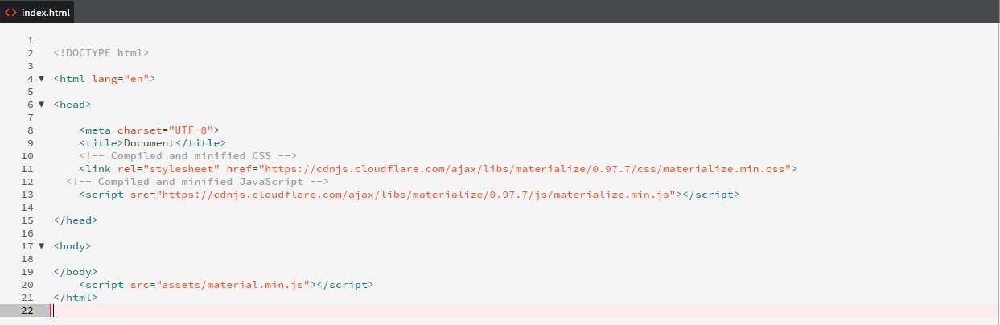
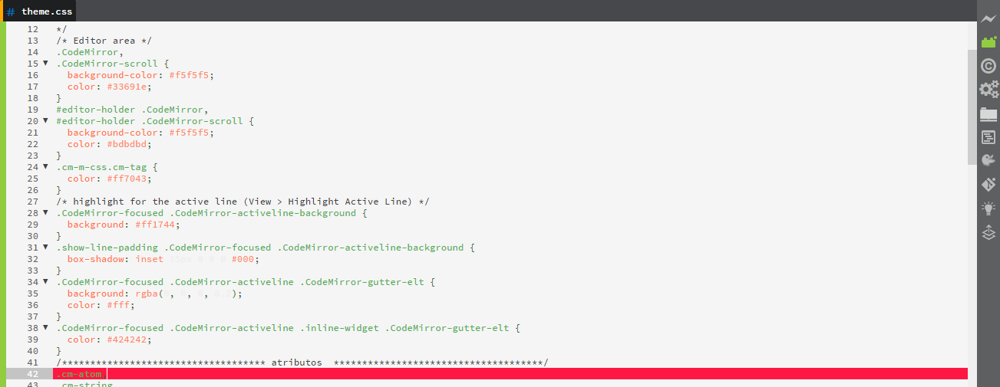
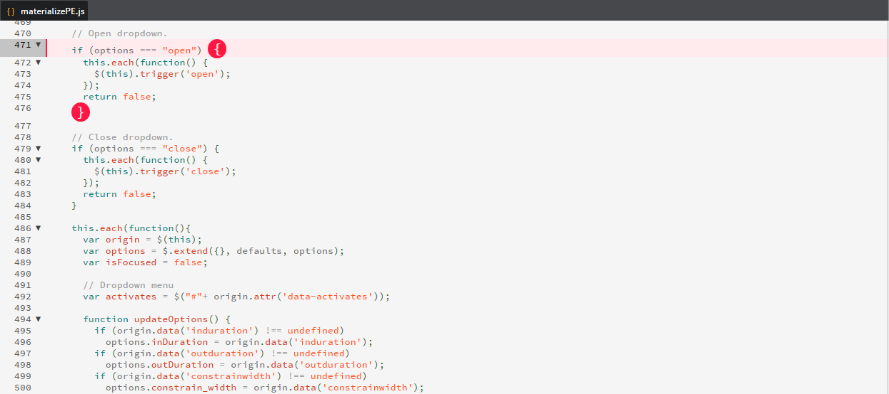

=======
# README
## This is the README for your extension "theme-color-coffee"
You can author your README using Brackets.io.

## Manual mode
Clone a copy of the repo:

```
git clone https://github.com/FredPizarro/theme-dark-coffee-color.git
```

in you location `Brackets/extensions/user` under your user directory.

Depending on your platform, this folder is located here:
* **Windows** `%USERPROFILE%/AppData/Roaming/`
* **Mac** `$HOME/Library/Application Support/`
* **Linux** `$HOME/.config/`

As this location is under your user directory, the content is persisted across Code updates.

=======
# Images

#### view in html

#### view in CSS

#### view in javascript



=======
# Contact
More contributions and suggestions in the theme to:

* E-mail:  Freddy_ps_3@hotmail.com
* Twitter: https://twitter.com/Fred_Pizarro


**Enjoy!**

